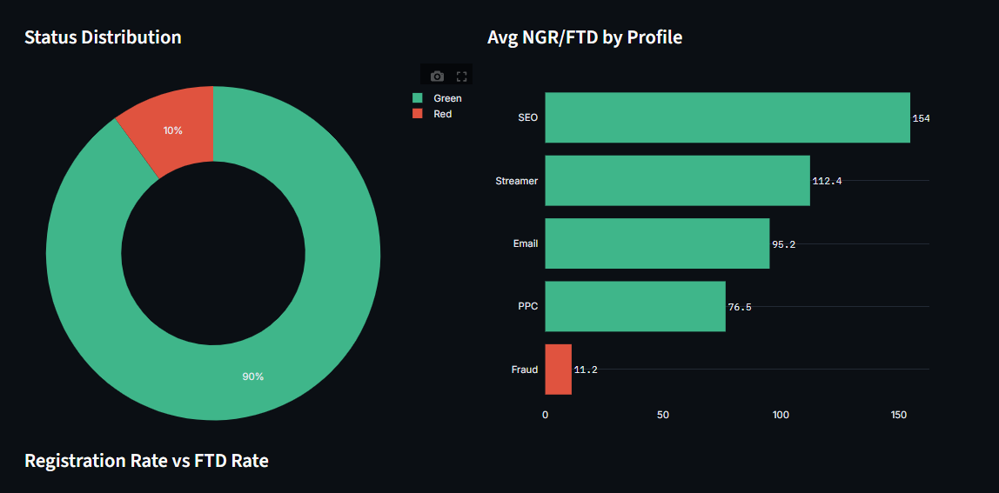
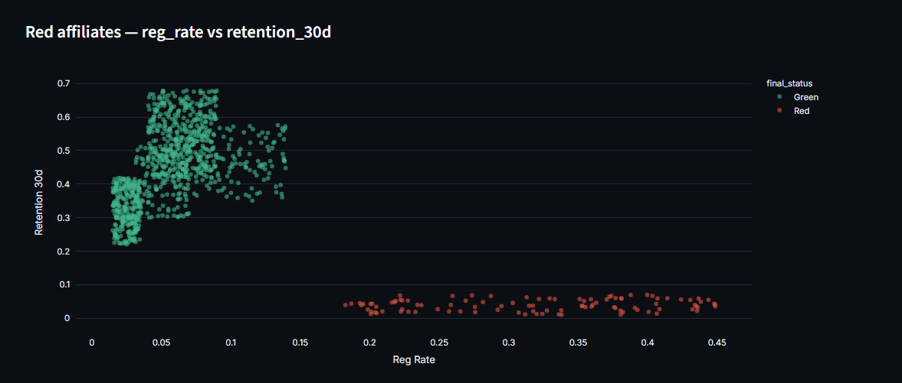
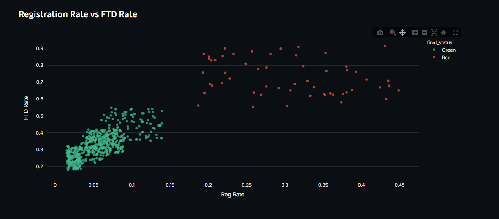

# Affiliate Scoring System

A rule-based scoring + fraud-detection dashboard for evaluating affiliate marketing partners, built to explore how a data-driven approach to affiliate quality control could work in an iGaming-style affiliate program.









---

## The problem

Affiliate programs pay partners for traffic (clicks → registrations → first deposits), but not all traffic is equal:

- A **PPC** affiliate and a **Streamer** affiliate will naturally have very different registration and conversion rates — comparing them on the same scale is misleading.
- Some affiliates send technically "valid" traffic that never converts into real, paying, returning players (bots, incentivized clicks, co-reg).
- Manually reviewing hundreds of affiliates every month against these patterns doesn't scale.

**Goal:** turn "is this affiliate's traffic actually good?" into a repeatable, explainable score, and separate that from "does this traffic look statistically weird?" — because those are two different questions that need two different tools.

## How it works

### 1. Rule-based scoring (`scoring/affiliate_scoring.py`)

Each affiliate is scored against benchmark thresholds for their **traffic-source profile** (SEO / PPC / Streamer / Email), not a single global threshold. For example, a 6% registration rate is a red flag for PPC but well within normal range for SEO — the profiles account for that.

Four metrics are checked per affiliate:

| Metric | Why it matters |
|---|---|
| `reg_rate` | Registrations / clicks — too high can mean bot or incentivized traffic |
| `ftd_rate` | First-time-depositors / registrations — signups that never became players are a red flag |
| `ngr_per_ftd` | Net gaming revenue per depositor — are the players actually worth anything? |
| `retention_30d` | Do players come back after a month, or was it a one-off? |

Each metric gets a Green/Yellow/Red flag against its profile's thresholds, weighted (`ngr_per_ftd` and `retention_30d` carry the most weight, since they reflect real player value rather than surface-level funnel metrics) into a single `final_score` and `final_status`.

Affiliates below a minimum sample size (too few clicks/registrations/FTDs to be statistically meaningful) are marked `Not Enough Data` instead of being scored — a small affiliate having one bad day shouldn't get the same red flag as a large one with a sustained pattern.

### 2. Anomaly detection (`scoring/scoring_ml.py`)

This is the part of the project I'm most glad I built the way I did, because I initially built it wrong and had to notice that.

**First attempt:** a `RandomForestClassifier` trained to predict `profile_name == 'Fraud'` from the same behavioral metrics. It scored a perfect F1 of 1.000.

**Why that number should worry you, not impress you:** in the synthetic dataset, `profile_name` is *generated directly from* fixed ranges of those exact same metrics (see `data/generate_data.py`). So the model wasn't learning to detect fraud — it was learning to reverse-engineer the data generator. That's classic **data leakage**: the label and the features share the same source of truth, so of course they line up perfectly. In production you don't get a `profile_name = Fraud` tag handed to you in advance; that's the thing you're trying to discover.

**What I replaced it with:**
- An **unsupervised Isolation Forest**, trained separately *within each traffic-source profile*, so a high-volume PPC affiliate is never compared directly against a low-volume Streamer. It flags affiliates who are statistical outliers relative to their own peer group — a more honest proxy for "this doesn't look like normal traffic" that doesn't assume the answer in advance.
- A `train_supervised_model()` option is still available for when a *real* investigated-fraud label exists (i.e., a column populated after actual manual review, not derived from the same features) — it deliberately excludes `profile_name` as a feature and raises a leakage warning if cross-validated F1 comes out suspiciously high (>0.97), so the same mistake can't quietly happen again.

### 3. Dashboard (`dashboard/app.py`)

A Streamlit app that ties both pieces together: upload a SQL dump / CSV / Excel export of affiliate data, get instant scoring, run anomaly detection on demand, and explore results across four views — Overview, Profiles, Fraud Detection, and a sortable/searchable Data Table with CSV export.

## Project structure

```
Affiliate Scoring System/
├── dashboard/
│   └── app.py              # Streamlit dashboard (self-contained scoring + charts)
├── scoring/
│   ├── affiliate_scoring.py  # Rule-based scoring logic, importable as a module
│   └── scoring_ml.py          # Isolation Forest anomaly detection + supervised option
├── data/
│   ├── generate_data.py    # Synthetic affiliate data generator (Faker + MySQL)
│   ├── create_database.sql
│   └── convert.py          # SQL dump → CSV converter
├── config.py                # Central DB config, reads credentials from .env
├── .env.example              # Template for local DB credentials (copy to .env)
└── requirements.txt
```

## Running it

```bash
pip install -r requirements.txt
streamlit run "dashboard/app.py"
```

The dashboard works standalone from an uploaded CSV/Excel/SQL-dump file and does **not** require a database connection. A database is only needed if you want to regenerate the synthetic dataset yourself:

```bash
cp .env.example .env        # fill in your local MySQL credentials
mysql -u root -p < data/create_database.sql
python data/generate_data.py
```

## Honest limitations

- **The data is synthetic** (generated with Faker + fixed metric ranges per profile), not real affiliate data. The benchmark thresholds in `BENCHMARKS` are illustrative starting points, not figures pulled from a real program — in a real setting they'd need to be calibrated against actual historical performance and revisited periodically.
- The rule-based weights (`ngr_per_ftd: 0.40, retention_30d: 0.30, ftd_rate: 0.20, reg_rate: 0.10`) are a reasonable starting hypothesis, not something validated against outcomes.
- No automated tests yet — on a next pass I'd add unit tests around `evaluate_row`/`evaluate_partners` edge cases (missing columns, profiles right at a threshold boundary, unknown profile names).

## What I'd build next

- Replace fixed thresholds with per-metric percentile bands computed from trailing 90-day data, so benchmarks adapt as traffic mix shifts.
- A "why" panel per affiliate that shows how much each of the 4 metrics contributed to their score, in plain language.
- Persist scoring history so an affiliate's trend over time is visible, not just a snapshot.
